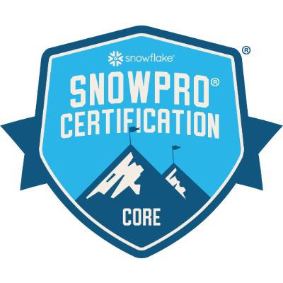
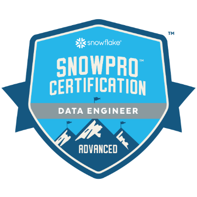
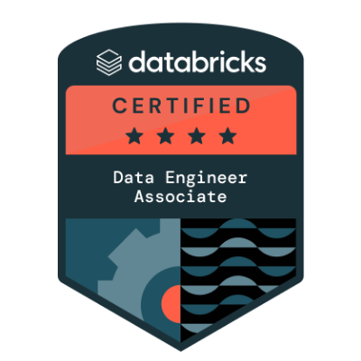
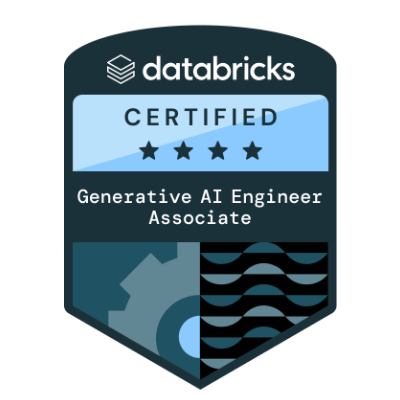

<h1 align="center">Hey , I'm Brian Denis Castelino! </h1>

###

<h3 align="center">Turning Data into Decisions  | AI & Data Engineer </h3>

###

---

<strong>Data Engineering Core</strong>

  
  
  
  
  
  
  
  
  
  
  

---

<strong>AI Engineering Core</strong>

  
  
  
  
  
  
  
  
  

---

<strong>Dev Tools</strong>

  

###

---
<h3 align="center">🏅Certifications & Badges</h3>

###

  
  
  
  
  
  
  
  
  
  
  

###

 

###

  
  

###

<picture>
  <source media="(prefers-color-scheme: dark)" srcset="https://raw.githubusercontent.com/bcastelino/bcastelino/output/pacman-contribution-graph-dark.svg">
  <source media="(prefers-color-scheme: light)" srcset="https://raw.githubusercontent.com/bcastelino/bcastelino/output/pacman-contribution-graph.svg">
  
</picture>

<!-- _Generated with [abozanona/pacman-contribution-graph](https://abozanona.github.io/pacman-contribution-graph/)_ -->
###

---
<h3 align="center">🔗Connect with me! </h3>

###

  
  
  
  
  

---

###